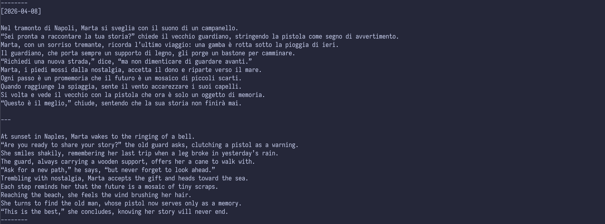

<!-- markdownlint-disable MD010 MD036 MD041 -->

[](#)

[](https://www.python.org/)
[](https://groq.com/)
[](#)

> An AI-powered CLI tool for learning languages through interactive storytelling

## Table of Contents

- [About](#about)
- [Features](#features)
- [Installation](#installation)
- [Usage](#usage)
- [How It Works](#how-it-works)
- [Screenshots](#screenshots)
- [Project Structure](#project-structure)
- [Configuration](#configuration)
- [Tech Stack](#tech-stack)
- [License](#license)
- [Acknowledgments](#acknowledgments)

---

## About

**storia** is a command-line tool that transforms vocabulary learning into an engaging experience. Instead of rote memorization, it generates unique short stories incorporating your target language words — making language acquisition natural, contextual, and memorable.

Whether you're a beginner building foundational vocabulary or an intermediate learner expanding your horizons, storia crafts narratives that help you internalize new words through meaningful context.

---

## Features

### AI-Generated Stories
- Creates original short stories (8-12 lines) using your vocabulary words
- Every word from your list naturally weaves into the narrative
- Bilingual output with English retelling for complete comprehension

### Smart Daily Progression
- Random vocabulary selection each day
- Automatically saves progress
- Fresh word selection daily

### Dual Mode System
- **Topic-Based Mode**: Generates complete stories from word lists
- **Random Mode**: Quick word review with single vocabulary items

### Secure Configuration
- API key stored locally in config (no .env required)
- Preserved across resets
- Input validation for security

### Graceful Error Handling
- User-friendly error messages
- Clear guidance on how to resolve issues
- Smooth exits instead of crashes

---

## Installation

### Prerequisites

- Python 3.13 or higher
- Groq API key ([get one free](https://groq.com))
- uv or pip package manager

### Install from Source

```bash
git clone https://github.com/Prathamdas3/storia.git
cd storia
uv sync
```

Or using pip:

```bash
git clone https://github.com/Prathamdas3/storia.git
cd storia
pip install -e .
```

---

## Usage

### Running the Application

```bash
storia
```

Or:

```bash
python -m storia
```

### First Run

On first launch, you'll be prompted to enter your Groq API key. This is saved securely to your local config file at `~/.storia/config.json`.

### Daily Usage

Each run:
1. Checks if it's a new day — resets if so
2. Generates a story in target language (Italian by default)
3. Outputs both the story and English translation
4. Saves story to local file
5. Switches to random mode for next run

### Modes

| Mode | Behavior |
|------|----------|
| `TOPIC_BASED` | Generates a story using vocabulary words |
| `RANDOM` | Shows a single word for quick review |

---

## How It Works

1. **Setup** — On first run, config file created at `~/.storia/config.json`
2. **Word Selection** — Random vocabulary words selected from language file
3. **AI Generation** — Groq API creates story incorporating all words
4. **Output** — Displays story + English retelling
5. **Persistence** — Stories saved, config updated for next run

---

## Screenshots



---

## Project Structure

```
storia/
├── src/storia/
│   ├── main.py              # CLI entry point & core logic
│   ├── ai.py                # Groq API integration
│   ├── helper.py            # Configuration utilities
│   ├── api_key_manager.py   # API key handling
│   ├── prompt.py            # AI prompt template
│   ├── constant.py          # Configuration constants
│   ├── __init__.py         # Package exports
│   └── languages/           # Vocabulary files
│       └── italian.json     # Italian word list
├── pyproject.toml           # Project configuration
├── README.md                # This file
└── LICENSE                  # MIT License
```

---

## Configuration

### Config File

Location: `~/.storia/config.json`

```json
{
  "today": "2026-04-09",
  "content": [["cane", "dog"], ["gatto", "cat"]],
  "length": 150,
  "mode": 1,
  "api_key": "your-groq-api-key"
}
```

### Stories File

Location: `~/.storia/stories.txt`

Contains all generated stories with dates for review.

---

## Tech Stack

| Technology | Purpose |
|------------|---------|
| [Python 3.13+](https://www.python.org/) | Core language |
| [Groq SDK](https://groq.com/) | AI story generation |
| [JSON](https://www.json.org/) | Configuration storage |

---

## License

This project is licensed under the MIT License - see the [LICENSE](LICENSE) file for details.

---

## Acknowledgments

- [Groq](https://groq.com/) - For providing the LLM API
- [Python Community](https://www.python.org/community/) - For continuous support

---

<!-- markdownlint-enable MD010 MD036 MD041 -->
